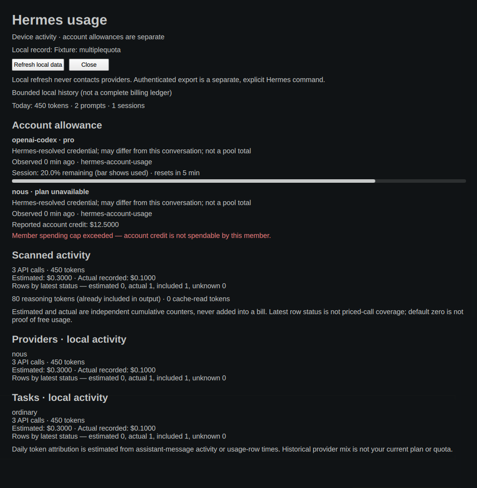

# Hermes Agent Usage 1.2.0

Local Hermes activity in Omarchy’s stock **Agents** panel, plus a separate,
themed **Usage Details** window for calls, tasks, provider breakdowns, independent
cost counters, and explicitly exported account allowances. No package-owned UI
is changed, and no extra agent records/tabs are fabricated.



Details preview uses synthetic fixture data; not an account statement.

See the [1.2.0 verification receipt](docs/verification-1.2.0.md) for tested
revisions, lifecycle counts, live integration scope and limitations.

## Install the Omarchy plugin

```sh
omarchy plugin add https://github.com/r0b0tlab/omarchy-hermes-usage.git --enable
```

Requires Omarchy/Quickshell, Linux `/proc`, pidfds and Python with `os.pidfd_open`,
`signal.pidfd_send_signal`, `waitid` and `WNOWAIT` (Python 3.9+ on a supporting
Linux kernel; tested here with the installed system Python). The collector uses
only the standard library, not a Hermes virtualenv. The stock `omarchy.agents`
widget must be enabled for its summary; Details works independently.

```sh
# Open / hide the optional details window
omarchy-shell shell summon io.github.r0b0tlab.hermes-usage '{}'
omarchy-shell shell hide io.github.r0b0tlab.hermes-usage

# Local refresh through the service’s own IPC target
omarchy-shell io.github.r0b0tlab.hermes-usage refresh
```

“Refresh local data” calls the host-injected service directly. It never runs a
shell command or an authenticated export. Concurrent refreshes are skipped, not
queued. The window follows the native theme, wraps plain text, supports resize,
scrolling, Escape and native close, and keeps the host’s open state consistent.

### Optional application-menu launcher

From a checkout of this repository, explicitly install the provided user-owned
launcher (not installed automatically):

```sh
install -Dm644 applications/io.github.r0b0tlab.hermes-usage.desktop \
  "${XDG_DATA_HOME:-$HOME/.local/share}/applications/io.github.r0b0tlab.hermes-usage.desktop"
```

Search **Hermes Usage Details** in the application launcher. Its only command is
the fixed `omarchy-shell shell summon … '{}'` operation above. No package files,
bar layout or keybindings need editing.

## What the numbers mean

- **Stock Agents summary:** today’s tokens/prompts/sessions, seven-day token bars,
  bounded historical model totals. `recentDays[].messageCount` is the stock
  contract’s legacy name for **tokens**, not messages. The hero says
  **Historical provider mix**, never an inferred current subscription plan.
- **Token buckets:** input, output, cache read and cache write. Reasoning is a
  separate detail **already included in output**, never added twice.
- **Daily attribution is estimated:** usage is stored per session/model/route,
  not per message. Recent rows use assistant-message activity by local day;
  without that map, counters are spread across their first/last recorded times.
  This is not a per-day invoice or precise per-call chronology.
- **Calls and tasks:** canonical `api_call_count` and `task`, including auxiliary
  work. Empty task means `ordinary`; an absent task column means `unknown`.
  Absent/invalid calls remain unavailable; known-call subtotals explicitly show
  the number of rows whose calls are unknown.
- **Estimated USD and actual recorded USD are independent cumulative counters.**
  Hermes UPSERT accumulates both but overwrites the latest status. Both positive
  stored counters are summed independently, regardless of that latest status;
  **never add them together into a bill**. A default zero is not a price
  observation: zero is displayed only when the matching latest status supplies
  evidence for it. Missing/invalid/unobserved amounts stay unavailable.
- **Rows by latest status:** estimated / actual / included / unknown. These are
  row counts, **not priced-call coverage**. One row can contain calls with mixed
  historical statuses. `included` is a recorded status, not a claim that all
  usage was free. Provider and task rows show separate costs and status counts.
- **Partial history:** a failed store/query, enumeration cap or scan cap is
  reported as partial. Even an untruncated bounded scan is not a complete
  billing ledger. Model/provider overflow is aggregated into `other`.

The existing `providerUsage` field is preserved for consumers, but stock Agents
ignores those details; the new window is what makes them visible. Account
observations never become an aggregate Hermes balance or unlabeled limit.
A fresh quota-only record works in Details without fabricated activity counts;
stock Agents may hide it because it does not understand the custom `accounts`
field. With neither stores nor observations, no empty stock tab is manufactured.

## Optional Hermes account-export companion

This is a **separate, native general Hermes plugin**, not an automatic shell
fetcher. Install and enable it only in the intended active Hermes profile:

```sh
hermes plugins install https://github.com/r0b0tlab/omarchy-hermes-usage.git#hermes-usage-export --no-enable
hermes plugins enable hermes-usage-export --no-allow-tool-override
hermes usage-export --help
```

The `#hermes-usage-export` subdirectory fragment is required. Normal Hermes
profile selection / `HERMES_HOME` applies to installation, activation and export.
The companion is self-contained in that subdirectory. No core hooks, schedulers,
account enumeration or modifications to other profiles are installed.

**Credential/network disclosure:** This explicit command lets Hermes resolve
provider credentials and may read or refresh OAuth credentials. Only sanitized
usage is exported locally. It never purchases credits or redeems reset tokens.
Installing/enabling the plugin does not itself fetch account allowances.

```sh
# Without --allow-network this refuses with exit 2, before optional API imports
hermes usage-export --provider openai-codex

# Explicit authenticated export (run only if you accept the disclosure)
hermes usage-export --provider openai-codex --allow-network
omarchy-shell io.github.r0b0tlab.hermes-usage refresh
omarchy-shell shell summon io.github.r0b0tlab.hermes-usage '{}'
```

Providers: `openai-codex`, `anthropic`, `openrouter`, `nous`. The pinned Hermes
API compatibility inspected for this release is
`f7990661a0c41b3fdd0018401597a3aa5c3c9c70`: `fetch_account_usage(provider)` and,
for Nous, `get_nous_portal_account_info(force_fresh=True)` followed by
`build_nous_credits_snapshot(info)`. Optional API failures produce static
unavailable state, not raw error messages. Exit 0 means an observation was
exported; exit 1 means unavailable or a refused write; exit 2 means no opt-in.

Every export, reader result and account UI retains this caveat:

> Hermes-resolved credential; may differ from this conversation; not a pool total

Anthropic may resolve a Claude credential; Nous pool resolution need not select
the current conversation’s account. Account observations are shared/scoped
allowances, **not a local token budget**. OpenRouter’s window is an **API key
quota**, not a claim about the whole account. Missing numeric allowances remain
unavailable. Request/minute throughput is not a subscription allowance.

Windows show `100 − observed used%`; the bar fills by **used**, turning urgent
at 90%. Exports expire at their actual fetched timestamp plus ten minutes, and
reset windows are hidden when expired. Stale cached observations are not stamped
fresh. The open UI updates expiry/reset/age each second. Local refresh normally
runs every fifteen minutes, so explicitly refresh after manual export; it cannot
extend the observation’s TTL or renew credentials.

Nous dollars come only from the typed `total_usable_credits` field, already in
**dollars**, and only fresh, logged-in `account_api` observations are accepted.
Paid-access denial/member-cap status is preserved: positive organisational
credit does **not** mean the member can spend it. Unknown member access remains
unknown. Codex/OpenRouter cash amounts exposed only as formatted prose are not
parsed or displayed; typed upstream support is needed for those balances.

### Trusted-Hermes transport boundary

The companion trusts Hermes’s credential resolution and network helpers. Those
helpers can use configured provider bases, buffer responses and follow redirects
according to their own implementation. The 16 KiB **exported file** cap is not a
network-response cap, endpoint allowlist, redirect policy or sandbox. This
plugin does not monkey-patch Hermes networking. No production provider calls
were made in local fixture validation; live provider availability is a separate,
explicitly approved verification step.

## Reads, writes and processes

Plugins run unsandboxed. Full disclosure:

| Component | Reads | Writes / processes |
|---|---|---|
| `Service.qml` | HOME, HERMES_HOME, XDG_STATE_HOME, TZ, HERMES_USAGE_PYTHON, HERMES_USAGE_REFRESH_SEC | Starts fixed `/usr/bin/python3 -I <plugin>/collector/bootstrap.py --write` at load and on timer/manual refresh; bounded console diagnostics |
| `bootstrap.py` → `launch.py` | Own plugin source, validated interpreter metadata, `/proc/self` process/FD/capability state | Forks ephemeral supervisor and worker; private pipes; persistent `$HOME/.hermes-usage-supervision/lock` in mode-0700 directory, mode-0600 lock; no PID files |
| `hermes-usage.py` | `$HERMES_HOME/state.db`, bounded immediate `$HERMES_HOME/profiles/*/state.db`; schema, counts, model/provider/task labels, usage counters and timestamps, never prompt contents; only four active-profile `usage-export/<provider>.json` files; local `quota_io.py` | Atomic `$XDG_STATE_HOME/omarchy/agents/usage/hermes.json`; exclusive mode-0600 `.quota-*` temporary in retained destination directory, removed after replace/failure; no children/network |
| `Details.qml` | That single local JSON via FileView; Omarchy’s existing Color theme singleton | No file writes or subprocess; injected service refresh and host hide only |
| Optional companion | Hermes’s profile-local settings and Hermes-resolved credentials through internal APIs, plus provider account endpoints **only with opt-in** | Atomic `$HERMES_HOME/usage-export/<provider>.json`, same private temporary discipline; Hermes itself may update credentials/caches/logs during resolution/refresh |
| Optional `.desktop` launcher | Desktop application-menu registration | Fixed summon command; user explicitly copies/removes this file |

Python imports may also create `__pycache__` files beneath installed plugin
sources according to the runtime’s bytecode setting. Hermes plugin management
writes its own active-profile installation/configuration metadata. The old
collector `.hermes.lock` is no longer created; supervision owns exclusion.

Defaults: `HERMES_HOME=$HOME/.hermes`, `XDG_STATE_HOME=$HOME/.local/state`.
SQLite connections request `mode=ro` and `query_only`; the existing fallback
opens a connection with SQL writes disabled if a read-only URI is refused.
SQLite may access associated WAL/shared-memory files. This is not a filesystem
sandbox. The Omarchy worker runs with the invoking user's privileges, performs
local-only collection, and neither reads credentials nor sends telemetry.

### Bounds and lifecycle

At most 128 profile directory entries considered, 32 candidate stores, 20,000
usage rows/store, 20,000 attribution session IDs/day groups, 64 model/provider
buckets (including overflow), 32 detail groups, 128-character model labels,
730 grouped session dates, 36,600 token-date buckets, 365 exported active dates,
5 million SQLite VM operations per connection
(callbacks at 10,000-op intervals), and a two-second busy timeout. Serialized
stdout and final JSON are capped at 256 KiB; output fails closed if degradation
cannot meet the ceiling. Worker stderr is capped at 8 KiB UTF-8 bytes.

Snapshot reader/writer traverse and retain nofollow directory FDs, validate
root-or-user-owned nonwritable ancestors and a user-owned destination, use
FD-relative exclusive temporary creation/replace/unlink, and fsync file and
directory. Snapshot paths beneath writable ancestors (including `/tmp`) or
symlinks are refused. Types, finite/ordered timestamps, TTL, nesting, integer
length, window count and 16 KiB size are checked. This is not authentication
against a malicious same-UID process that can replace plugin code.

Supervision uses a pipe lease so shell/Process destruction cancels the worker
without killing its cleanup owner. The direct parent reserves its unreaped
worker identity; its final process-group signal precedes leader reap. It then
signals/reaps adopted descendants to ECHILD. It bounds collection to 60 seconds
plus a three-second TERM grace, but keeps the persistent lock while cleanup is
pending. Kernel uninterruptible sleep/persistent permission failures can prevent
a finite cleanup deadline. External SIGKILL of the **supervisor itself** prevents
cleanup. See [security boundary](docs/security-boundary.md) and the detailed
[lifecycle implementation](docs/security-lifecycle.md). Independent security
review remains a release gate.

## Configuration and removal

`HERMES_USAGE_REFRESH_SEC` overrides local polling (60–86400 seconds; default
900). `HERMES_USAGE_PYTHON` must resolve to a root-owned, non-group/world-writable
regular executable with no setuid/setgid bits; invalid overrides are refused and
fall back to `/usr/bin/python3`. All interpreter stages use `-I`; the worker’s
closed environment retains only HOME, XDG_STATE_HOME, HERMES_HOME and TZ.

```sh
omarchy plugin remove io.github.r0b0tlab.hermes-usage
rm -f "${XDG_STATE_HOME:-$HOME/.local/state}/omarchy/agents/usage/hermes.json"
rm -f "${XDG_DATA_HOME:-$HOME/.local/share}/applications/io.github.r0b0tlab.hermes-usage.desktop"

# Separately, in the profile where you installed the optional companion:
hermes plugins disable hermes-usage-export
hermes plugins remove hermes-usage-export
rm -f "${HERMES_HOME:-$HOME/.hermes}/usage-export/"{openai-codex,anthropic,openrouter,nous}.json
```

Leave `$HOME/.hermes-usage-supervision/lock` in place while any refresh/cleanup
may exist: unlinking it can break exclusion. The empty persistent lock can be
left indefinitely. Remove the directory only after confirming all owned
supervision has ended. No automatic uninstall cleanup or auth changes occur.

The stock panel may log a harmless missing `assets/hermes.svg` warning and use
its generic glyph; adding a mark to its package-owned assets is outside scope.

## Development / verification

Use isolated HOME, HERMES_HOME, XDG_CONFIG_HOME, XDG_STATE_HOME and TMPDIR under
a private, nonwritable-ancestor scratch directory. Do not use production auth or
restart the production shell. Run:

```sh
/usr/bin/python3 -B -m unittest discover -s tests -v
omarchy plugin validate .
/usr/lib/qt6/bin/qmllint -I /usr/share/omarchy/shell Service.qml Details.qml
git diff --check
```

For lint, `qs.Commons` needs a `qs/Commons` import mapping to the installed shell
Commons; an isolated copied import tree resolves this. Without it qmllint emits
unresolved-theme warnings even with exit 0; that is not visual proof. With the
mapping, only the framework’s existing QProcess::ExitStatus warning is expected.
Security lifecycle fixtures require installed Quickshell and Linux x86_64 ptrace
access. The accounting regression reads the installed Hermes UPSERT SQL as AST
and executes it in memory, without importing Hermes credentials or using live DBs.

`tests/details_ui_runner.py` copies Details plus installed Commons to private
scratch and drives only its owned standalone Quickshell window on the real
compositor. It captures empty/stats/unknown-cost/partial/multiple-quota/expired/
long-label cases and tests native-close, Escape, reopen, resize, TTL and refresh
busy behavior. This runner is a local Hyprland/Lua integration fixture, not
production plugin code. `tests/isolated_hermes_cli.py` guards the real installed
CLI entrypoint against network, subprocesses, external credential reads and
external writes for local discovery and opt-in-false validation.

Fixture screenshots prove rendering, not actual account balances. They are not
published as live quota receipts. Live installation/provider tests and external
publication remain separate gates.

MIT — see [LICENSE](LICENSE).
